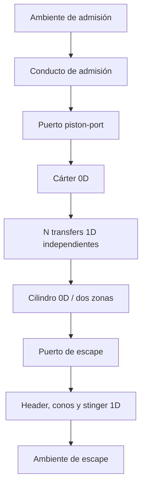

# Especificación física adjudicada

Versión: **C0.3-final-adjudication** · 2026-09-06

Estado: **SCIENTIFIC_BASELINE_NOT_READY**. C0.1 y C0.2 se conservan sin modificación. Este corpus adjudica cláusulas, pero no autoriza arquitectura ni producción. SELECTED no significa validación experimental ejecutada.

## Autoridad y alcance

Las fichas PHY-001–010 conservan sus IDs. PHY-005 contiene una interfaz física seleccionada parcialmente: su cierre causal sigue en C03-BLK-001. Esa excepción impide declarar esta especificación ejecutable completa. Las demás selecciones son contratos de modelos reducidos, sujetos a los ensayos indicados y a calificación experimental por hardware.

## PHY-001 — geometría

Fenómeno: crank-slider centrado rígido. Modelo: r=S/2; s=r(1−cosθ)+l−sqrt(l²−r²sin²θ); Vc=Vclear+πB²s/4; Vd=πB²S/4; Vcc=Vcc,TDC−πB²s/4. Se exige comprobar que esta última expresión representa el cárter medido; configuraciones con bombeo adicional no representado quedan fuera. Estado θ[rad], θdot=2πN/60. Inputs B,S,l[m], l>r, Vclear,Vcc,TDC[m³] positivos y volumen mínimo positivo. Áreas Aport(θ)[m²] desde contornos medidos, count entero aplicado una vez. Outputs V,dV/dθ,A. Geometría no calibrable contra torque. Misma V para termodinámica y trabajo. VAL-001/002; fuente crank-slider geométrico C0.2.

## PHY-002 — termoquímica SELECTED

Combustible: **isooctano gaseoso C8H18**, masa molar **114.232 kg/kmol** conforme dataset. Oxidante seco: X(O2)=1/4.76, X(N2)=3.76/4.76; sin Ar ni humedad. Aire real húmedo o gasolina comercial no se asimilan silenciosamente. Especies cerradas, orden: C8H18,isooctane; O2; N2; CO2; H2O. No fresh/residual como especie. CO/H2/OH/H/O/NO sólo en oráculo de calificación, no transportadas por GEN1.

Datos: NASA7 del extracto C0.2 `thermo_species.json`, primeras cinco especies. Ru=8314.46261815324 J/(kmol K). Coeficientes por intervalo, sin blending: T<1000 K usa rama baja, T≥1000 alta; no extrapolar fuera de 200–6000 K. El rango de uso GEN1 es más estrecho.

Para cada especie Rk=Ru/Mk; cp,k/Rk=a1+a2T+a3T²+a4T³+a5T⁴; hk/(RkT)=a1+a2T/2+a3T²/3+a4T³/4+a5T⁴/5+a6/T; sk°/Rk=a1 lnT+a2T+a3T²/2+a4T³/3+a5T⁴/4+a7. Referencia p°=101325 Pa y formación incluida. Mezcla: R=ΣYkRk; h=ΣYkhk; u=h−RT; cp=ΣYkcp,k; cv=cp−R; γ=cp/cv; p=ρRT; c²=γRT para composición congelada. Entropía: ΣYk[sk°−Rk ln(Xkp/p°)], con límite X lnX=0. Inversión de u(T,Y) monótona mediante cv>0, raíz dentro del dominio, nunca clipping de T.

LHVg=**44.650141231 MJ/kg** para reactantes gaseosos y H2O vapor, a 298.15 K y 101325 Pa. No es LHV de líquido. HHV no se utiliza. No sumar este LHV al balance que ya conserva energía con formación.

Dominio contractual: 300≤T≤2200 K, 5·10⁴≤p≤5·10⁶ Pa; Yk≥0, ΣYk=1, composición alcanzable por mezclado de aire, premix 0.6≤φ≤0.8 y sus productos/reacción parcial. φ se refiere al premix suministrado, no se calcula como ratio absurdo en productos sin fuel. Arranque sólo con aire o esos productos. En SOC: 350≤T≤750 K, 0.3≤p≤1 MPa, fracción residual 0–0.4. Cada punto debe mantener el dominio durante todo el ciclo; un estado fuera produce OUT_OF_DOMAIN, no resultados válidos extrapolados.

Fase: fuel pparcial ≤0.9 psat(min(T,373.28 K)); para 300–373.28 K, log10(psat/bar)=3.93679−1257.84/(T−52.415). Por encima se conserva ese límite inferior de saturación sin extrapolar Antoine. Agua: si T<647.096 K, pH2O≤0.9 psat(T); ln(psat/22.064 MPa)=(647.096/T)Σbi τ^ei, τ=1−T/647.096, b=(−7.85951783,1.84408259,−11.7866497,22.6807411,−15.9618719,1.80122502), e=(1,1.5,3,3.5,4,7.5). Por encima del crítico y dentro de p GEN1 no hay condensación líquido-vapor. Es un control de fase de gas ideal diluido, no equilibrio multifásico de solución. Paredes que provoquen película/condensación material invalidan el caso. No evaporación ni aceite líquido resueltos.

Error químico admitido: **2% en T adiabática UV** frente al oráculo de once especies de C0.2, como presupuesto de aproximación elegido para GEN1, no constante de la literatura. Calificar cada condición SOC y mezcla/residual con VAL-005 antes de atribuir validez al punto. La malla exploratoria C03 produce máximo1.483% en42 casos de su filtro. El subconjunto con TSOC350–750K y pSOC≤1MPa contiene28 casos y máximo1.40088%; no demuestra cota uniforme continua. La calificación es una comprobación específica definida, no elección de química por Codex. Si falla, el punto es UNSUPPORTED_CHEMISTRY; no ampliar el dominio para mantener potencia. No se predicen emisiones, knock, misfire ni disociación instantánea. Parámetros termoquímicos no calibrables. Fuentes C03-R01/02/03; VAL-001/005/008.

## PHY-003 — inventarios y scavenging SELECTED

Cárter: una zona homogénea con m_k[kg], U[J], Vcc conocido; dm_k=Σṁ_jYdonor,k dt; dU/dt=−pVdot+Qdot+Σṁh0. Gas entrante pierde energía cinética resuelta al mezclarse pero conserva h0. No se integra un momentum ficticio de cárter.

Cilindro: una zona fuera del barrido; **dos zonas A (admisión) y B (bulk)** desde primera apertura de transfer hasta cierre final del escape. Requiere transfers cerrados al EPC y combustión posterior al EPC. Presión común, temperaturas/composición separadas; no se resuelven jets espaciales. Al activar: B contiene todo, A tiene masa y volumen cero. Al EPC: sumar m_k y U, e invertir EOS de la zona única; no promediar temperaturas.

Entradas de transfers →A; reingreso de escape→B, cada una con Y y h0 reales. Salida de escape: β=mA/(mA+χmB); Yout=βYA+(1−β)YB; hout=βhA+(1−β)hB. Salida inversa por transfers: δ=mA/(mA+mB) con las mismas combinaciones usando δ. Cada caudal se descompone entre zonas con esos pesos. Mezcla interna A→B: ṁmix=mA/τ, τ=κ/ω, ω=2πN/60. A cero no produce salida. χ>0 y κ>0 son dos inputs adimensionales, constantes por geometría dentro del dominio calificado; se identifican mediante trazadores temporales y trapping, no mediante torque. No existe valor universal por defecto.

Estados útiles H_z=Σm_zk hk(Tz), m_zk y presión; Utotal=ΣH_z−pVc. Rm_z=Σm_zkRk; Vz=Rm_zTz/p; Sz=Qz+Σṁ_j h0,j, incluyendo intercambio interno firmado. Bz=Σhk(Tz) ṁ_zk; αz=Rm_z/(mz cp,z). Entonces:

pdot=[Σz{αz(Sz−Bz)+Tz ΣkRk ṁ_zk}−p Vdotc]/[Vc−ΣzαzVz];
Hdot_z=Vz pdot+Sz; Tdot_z=(Hdot_z−Bz)/(mz cp,z).

Denominador=ΣVz cv,z/cp,z>0. Al nacer A vacía con varios donors: Ybirth=Σṁj+Yj/Σṁj+, hbirth=Σṁj+h0j/Σṁj+; obtener Tbirth invirtiendo h(Tbirth,Ybirth)=hbirth a presión común. Usar ese límite para T,Y,α, con VA=0; si no entra masa, omitir zona vacía. No introducir una masa semilla. El calor superficial se reparte por Vz/Vc, aproximación geométrica explícita. h_z es entalpía de mezcla a Tz; no sólo entalpía sensible.

Demostración de conservación: el intercambio A→B aparece con igual m_k y h en signos opuestos; Σdm_zk conserva el balance externo por especie. Sumando Hdot y diferenciando U=ΣH−pV: Udot=ΣSz−pVdot. Suma de volúmenes obtenida de EOS da Vdotc por la ecuación de pdot. El merge conserva exactamente m_k,U; las diferencias discretas son NUMERICAL_RESIDUAL.

Fuentes: balances abiertos y familia multizona revisada en C0.2; β y τ son closure reducido propio adjudicado, no correlación publicada de Blair/Benson. No pretende resolver estructura tridimensional ni universalidad de χ,κ. Evidencia algebraica: research/scavenging_balance.py; validación independiente pendiente VAL-019/EX. Se exige identificación local de rango completo del Jacobiano de observables respecto de logχ,logκ y bandas de confianza; parámetros no identificables impiden calificar hardware, no autorizan ajuste adicional libre.

## PHY-004 — conductos y topología SELECTED

U=(ρ,ρv,ρE,ρYk), E=u+v²/2; ∂t(AU)+∂x(AF)=(0,pA′+Sf,qw′,0…); F=(ρv,ρv²+p,v(ρE+p),ρvYk). A[m²], x[m], t[s]. Geometría fija, positiva, continua por tramos; conos unidos en caras de malla, sin salto abrupto de área admitido como simple source. No química en ductos. Transfer ducts almacenan masa, energía, especies y trazadores.

Flechas indican orientación nominal; todas las interfaces admiten inversión. N≥1 entero, ramas medidas independientes conectadas directamente a volúmenes con almacenamiento. No unión masa-cero adicional. GENERAL_JUNCTION=OPTIONAL_FUTURE; VAL-012 no obligatorio GEN1. No se elimina interacción entre ramas: ocurre por la presión y los inventarios del cárter/cilindro.

| Interfaz | Normal positiva | Donante/estado exterior | Inventario y transferencia |
|---|---|---|---|
| Ambiente–admisión | Ambiente→ducto | Premix vapor seleccionado, p0,T0 en entrada; p estática exterior en salida | Reserva infinita, flujos al ledger |
| Admisión–cárter | Ducto→cárter | Estado causal PHY-005 | Puerto con A(θ), sin almacenamiento |
| Cárter–transfer i | Cárter→ducto i | Cárter o rama real | Misma masa/energía/especies a ambos lados |
| Transfer i–cilindro | Ducto i→cilindro | Rama o salida ponderada PHY-003 | Puerto correspondiente, sin count duplicado |
| Cilindro–escape | Cilindro→ducto | Yout,hout de zonas o rama real | Puerto y fuerza sobre estructura |
| Stinger–ambiente | Ducto→exterior | Aire seco fresco al reingresar | Reserva a pambient,Tambient medidos |

Extremo exterior: salida subsónica pstatic=pambient; entrada subsónica p0,T0,Yambient prescritos y característica saliente del tubo. No imponer a la vez velocidad y presión. Reflexión de presión de baja amplitud/baja frecuencia R→−1; NO non-reflecting. GEN1 restringe calificación acústica del extremo a ka≤0.05 y |Mout|≤0.2. Aproximación sin corrección de extremo: error de fase de orden 2·0.6133 ka, ~0.0613 rad en el límite, a partir de C03-R09; no cota de error de motor con flujo caliente. Exigir VAL-010/018 con espectro relevante, incluyendo fuera de banda como incertidumbre, no borrarlo. Supersónico en el extremo o nube de escape recirculada externa: unsupported. Interior de conducto puede contener shocks; no resolver cámara de expansión como silenciador no reflectante.

## PHY-005 — puerto: parte cerrada y límite expreso

SELECTED: área Aeff=Cd Ageom,total; Ageom,total=count·Ageom,una sólo si todos los puertos comparten estados y contorno. Unidades m². Cd(dirección, apertura relativa, Π=pback/p0donor) es mapa rectangular suministrado; interpolación bilineal en apertura y Π, dos tablas direccionales, sin extrapolación ni aplicar count/Cd en otro lugar. Cd≥0 finito; áreas y estaciones del ensayo son obligatorias. Sin mapa: MISSING_DISCHARGE_DATA; Cd constante sólo fixture no calificado. No default de ingeniería para afirmar resultados de motor.

Entre dos reservas quiescentes: donor es mayor presión; a igualdad flujo cero. Iséntropa congelada de donor: s(T,p,Y)=s0; h0−h=vjet²/2; G=ρvjet. Punto crítico maximiza G y satisface vjet=c; evaluar en pexit=max(pback,pcrit). ṁ=AeffG con signo; especies ṁYdonor; energía ṁh0donor. No usar γ constante con NASA. Cada orientación conserva una única transferencia temporal compartida.

**NO SELECTED como cierre terminado:** sustituir estado del ducto por reservorio estático. A una cara de ducto llega una característica acústica saliente; el estado p_b,v_b debe ser compatible con esa onda y con el donor. La formulación candidata es media solución de Riemann (rarefacción isentrópica o shock con Hugoniot) más restricción de descarga, contacto con p,v comunes y balance de entalpía total. No se han certificado sus ramas al invertir/chocar/estrangular con EOS variable. Se prohíbe elegir sólo max(p_cell,p_0D). **C03-BLK-001** conserva este único problema físico; no son blockers el mapa Cd, count ni la ley entre reservas.

Fuerza del ducto: flujo de momentum A(ρv²+p); diferencia de fuerzas recogida por la estructura. 0D no conserva momentum como estado. VAL-004/013/014/016/017; evidencia nozzle_research C0.2. El algoritmo causal pendiente no se delega a Codex.

## PHY-006 — reacción y progreso SELECTED

C8H18+12.5O2→8CO2+9H2O. Entrada φ=0.6–0.8; φ=1 o rico fuera de GEN1. No se oxida todo el O2 en mezcla pobre; sobrante permanece. Fuel no consumido permanece químicamente fuel, aunque su etiqueta sea residual. No CO/H2 ni disociación en evolución; dominio y calificación PHY-002.

Al SOC, zona homogénea cerrada: ξmax=min(nfuel,nO2/12.5), kmol, fijo para ese evento. ξ(θ)=ηburn ξmax xb(θ), 0<ηburn≤1. xb=(1−exp(−a z^(n+1)))/(1−exp(−a)), z=(θ−SOC)/Δθ entre0 y1, luego0/1; a>0,n≥0,Δθ>0. Requerir SOC y burn-end en intervalo de puertos cerrados. Actualizar cantidades con coeficientes estequiométricos; resolver T con U y composición nueva. No añadir Q=LHV ξ. Masa elemental conservada; energía química se transforma al cambiar composición.

SOC, duración, a,n,ηburn son inputs de ajuste de presión/heat release sobre CALIBRATION_DATA; no cambios con held-out. Curvas tabuladas de parámetros contra RPM/carga con ejes medidos e interpolación multilineal, sin extrapolación. Ignición prescrita no predice estabilidad de llama. Fuente Wiebe C0.2 y balances; VAL-005/023/025.

## PHY-007 — calor y transporte SELECTED con límites

Qgas=Σh_s A_s(Tw_s−Tgas); positivo hacia gas. Tw[300,1000]K prescritas por superficie/segmento medido, no estados estructurales. No promesa de temperatura del metal. Áreas: head/piston medidas; liner expuesta según geometría. Para dos zonas asignar A_s,z=A_s Vz/Vc.

Cilindro/head/piston: Annand convectivo h=a k/B Re^0.7, Re=ρ(2SN/60)B/μ. a input identificado independiente de torque, 0.35–0.8; propiedades de mezcla a Tgas. No heredar coeficiente de motor grande como calibración de GEN1. Se selecciona ley de calor integrada efectiva; radiación no separada, ni flujo local de pared predictivo. Compensación del término omitido sólo mediante a dentro del dominio experimental identificado. Exigir comparación calor integrado y presión motored/fired; si a sale de rango o residuo térmico sistemático persiste, el modelo falla y requiere BCR, no ampliar a silenciosamente. C03-R04. Este párrafo no afirma que la correlación esté validada en este 2T.

Cárter: cierre lumped medido Hcc(N,Tgas,Tw)[W/K]≥0, hcc=Hcc/Awet. Mapa tridimensional multilineal, sin extrapolación. Qcc=Hcc(Tw−Tgas). Hcc se obtiene de ensayo térmico/motored y caudal independiente, no de torque; input con incertidumbre y geometría. No adiabático por falta de datos: MISSING_THERMAL_DATA. Modelo Newton de conductancia global identifica efecto térmico sin atribuir turbulencia de cilindro al cárter.

Ductos: se adjudica **Gnielinski cuasiestacionario de conducto equivalente**, con Tw prescrita y factor multiplicativo Cq por familia geométrica identificado en bancada térmica pulsante; Cq>0, fijo por geometría/intervalo calificado, no por cada dato held-out. h=Cq k Nu/Dh, Re=ρ|v|Dh/μ, Pr=μcp/k. Longitud L es longitud física del segmento térmico definido en inputs, no Δx; Dh=4A/Pw. El coeficiente es promedio efectivo del segmento aplicado localmente usando propiedades locales; esta localización es aproximación explícita.

Laminar UWT: NuL=[3.66³+0.7³+(1.615(RePrDh/L)^(1/3)−0.7)³+{(2/(1+22Pr))^(1/6)(RePrDh/L)^(1/2)}³]^(1/3). Turbulento: fT=(1.8 log10Re−1.5)^−2; NuT=(fT/8)(Re−1000)Pr/[1+12.7 sqrt(fT/8)(Pr^(2/3)−1)]·[1+(Dh/L)^(2/3)]·(Tgas/Tw)^0.45. Para Re≤2300 usar NuL; Re≥4000 NuT; en medio interpolación lineal entre valores en2300/4000. Límite v=0 finito, sin división por v. fT es auxiliar de correlación de calor; NO sustituye fDarcy del balance de momentum.

Dominio adjudicado: 0≤Re≤10^6, 0.6≤Pr≤1.0, 0<Dh/L≤0.1; gas monofásico y pared medida, conducto equivalente no separación masiva. Conos/curvaturas se califican por presión/calor medido y Cq, no por afirmar que una correlación de tubo recto los valida. La aplicación instantánea en reversión no resuelve memoria de capa límite; se exige validar calor por ciclo y enfriamiento medio en VAL-018. No se publicará h instantánea como medición predicha. Se permite esta aproximación porque el objetivo térmico GEN1 es pérdida integral y estado del gas; discrepancia fuera de incertidumbre obliga a revisar el modelo, no normalizar resultados. Fuente original C03-R05; extensión declarada propia.

Transporte: modelo dilute-gas mixture-averaged de Cantera3.2/Kee, con NASA del dataset y parámetros en thermo_transport.yaml. Isooctano no lineal: σ=6.414Å, ε/kB=458.5K, dipolo0, polarizabilidad0, relajación rotacional1; otros cuatro gases: parámetros GRI3 exportados, no termodinámica GRI sustituta. μmezcla=ΣXi μi/ΣjXjΦij, Φij=[1+sqrt(μi/μj)(Mj/Mi)^0.25]²/sqrt(8(1+Mi/Mj)); kmezcla=0.5[ΣXi ki+1/(ΣXi/ki)]; Pr derivado. Propiedades puras por teoría cinética y colisiones de C03-R07; input exportado versionable fija la referencia. T300–2200K; no difusión de especies molecular resuelta. Se requiere equivalencia numérica a referencia3.2 o tabla certificada; no dejar elegir otra regla de mezcla. El dataset de transporte es estimado, con incertidumbre propagada en validación térmica; no recalibrar μ/k contra potencia.

## PHY-008 — pérdidas SELECTED

Darcy: fD=8[(8/Re)^12+1/(A+B)^(3/2)]^(1/12); A=[2.457 ln(1/((7/Re)^0.9+0.27ε/Dh))]^16; B=(37530/Re)^16. Re=ρ|v|Dh/μ; τw=fDρv|v|/8; Sf=−fDρv|v|Aduct/(2Dh). En Re→0 usar límite Sf=−32μv Aduct/Dh²; en v=0 Sf=0. Potencias en logaritmos para evitar overflow. 0≤ε/Dh≤0.05, Re≤10^6; régimen cuasiestacionario equivalente; no memoria viscosa predictiva. Fuente C03-R08. Energía total no tiene sumidero de fricción de pared fija adiabática; pérdida cinética se convierte en interna.

Pérdidas de curvas realmente presentes: por cada tramo geométrico medido j, K_j(dirección,Re)≥0 con estaciones y velocidad de referencia locales, mapa lineal por Re sin extrapolación; distribuir κj=Kj/ℓj [1/m] sobre longitud física de la curva. Añadir Sf,j=−κjρv|v|A/2, sin sumidero de energía total. Es cierre medido de fuerza efectiva, no K universal. Rectos: κ=0. K reducido de bancada debe descontar fricción distribuida y excluir estaciones de puertos que ya están en Cd. Inputs deben mostrar esa reducción y su incertidumbre; si falta, MISSING_LOSS_DATA. Saltos de área abruptos/uniones universales no entran en GEN1. Presión geométrica pA′ no es pérdida empírica.

VAL-018 mide el cierre conjunto pulsante; función cuasiestacionaria no predice histéresis de esfuerzo. La aceptación de presión/calor integrado delimita puntos válidos; no se ajusta K para compensar dispersión numérica.

## PHY-009 — procedencia y métricas SELECTED

Cada masa lleva partición de tags F0 (fresco no visitó cilindro en ventana actual), F1 (fresco ya visitó), R (material del cilindro expuesto a combustión anterior) y X (gas exterior ajeno a la entrega fresca). No especies químicas. Ambiente de admisión F0=1; ambiente de escape X=1. R no es sinónimo químico de gas quemado: incluye fuel que pudo quedar sin quemar después de SOC. Reportar por separado fracción química de productos y fracción externa mX/mcyl. Las cuatro fracciones suman1; residual fraction=mR/mcyl no incluye aire exterior X.

En TPO, F1→F0 en toda la red finita, registrando relabel explícito. En transferencia hacia cilindro, F0→F1 en receptor; Dunique=integral de masa F0 entrante por transfers. Entradas sucesivas de F1 no se cuentan de nuevo. En SOC, tags del cilindro→R para nueva cohorte residual, sin cambiar especies/energía. En reingreso de escape conservar tags/Y/h del verdadero donor; no reemplazar por aire salvo extremo externo.

Al EPC: delivery ratio gross=masa fresca positiva suministrada por transfers/(ρref Vd), ρref del premix a p0,T0 de admisión; trapping efficiency=mF1,cyl/Dunique; scavenging efficiency=(mF0+mF1)cyl/mcyl; residual fraction=mR/mcyl; charging efficiency=(mF0+mF1)cyl/(ρrefVd). Short-circuit fraction net=integral neta F1 a través del puerto de escape/Dunique. También informar gross y retorno por separado: net puede diferir del flujo bruto. Masa F1 que regresa al cárter no es short-circuit de escape. Dunique=F1retenida+F1fuera_del_cilindro+F1exportada_exterior_neta, al partir F1=0. Denominador cero→UNDEFINED_METRIC, no cero físico. Las definiciones de cohorte difieren de fórmulas estacionarias sin reflujo: metadatos obligatorios en comparación experimental. Parámetros de tags no calibrables; VAL-016/019.

## PHY-010 — performance SELECTED

Wc=∮pcdVc; Wcc=∮pccdVcc; Wg=Wc+Wcc; IMEPc=Wc/Vd; IMEPnet,g=Wg/Vd. Indicados: Tc=Wc/(2π), Pc=Wc N/60, con N[rpm]. Reportar gas-net por separado; no restar bombeo dos veces. Mapa FMEPmech(N,IMEPnet,g,Tlub,Twall)[Pa] de C0.2, interpolación multilineal dentro de envolvente rectangular medida; no extrapolar. Wb=Wg−FMEPmechVd−Waux; BMEP=Wb/Vd; Tb=Wb/(2π); Pb=WbN/60. Waux[J/rev] con lista de auxiliares y plano de medida. Sin mapa válido: BRAKE_OUTPUT_UNAVAILABLE. Pérdidas mecánicas no se descomponen ficticiamente entre anillos/cojinetes. Eficiencia al fuel se refiere a fuel suministrado y LHVg, no sólo retenido. VAL-022/024/025 y EX de C0.2. Fuentes primer principio y frontera adjudicada C0.2.

## Fuentes de adjudicación

- C03-R01: [NASA TM4513, McBride et al., 1993](https://ntrs.nasa.gov/citations/19940013151), dataset `nasa_gas.yaml` de Cantera 3.2.0 preservado por C0.2 y extracto numérico en research/inputs/thermo_species.json. No confundir con NASA9.
- C03-R02: [NIST SRD69, isooctano](https://webbook.nist.gov/cgi/cbook.cgi?ID=C540841&Mask=4&Type=ANTOINE&Plot=on), datos originales de Willingham et al. 1945, DOI 10.6028/jres.035.009. Masa molar se fija por la tabla atómica del dataset, no mezclando redondeos NIST.
- C03-R03: [IAPWS SR1-86(1992), saturación](https://iapws.org/technical-guidance/release/Supp-sat.download). Se usa para admisibilidad de fase; no reemplaza la EOS gaseosa.
- C03-R04: [Annand, 1963](https://doi.org/10.1243/PIME_PROC_1963_177_069_02), original consultado también en [reproducción](https://www.scribd.com/document/830191556/Annand). Se selecciona sólo término convectivo; no se reconstruye un exponente ilegible del término radiativo.
- C03-R05: Gnielinski, “On heat transfer in tubes”, IJHMT 63 (2013),134–140, [original reproducido](https://www.scribd.com/document/786670780/Gnielinski-single-phase). Correlación de tubos estacionarios; la extensión cuasiestacionaria GEN1 es una aproximación adjudicada, no resultado experimental de ese artículo.
- C03-R06: [Yelvington, MIT, 2004, tesis doctoral](https://dspace.mit.edu/server/api/core/bitstreams/4cf65d4e-a294-4623-b1b2-8b6b238fc37d/content), apéndice de transporte: isooctano, parámetros atribuidos a LLNL. Son parámetros estimados de transporte, no mediciones de GEN1.
- C03-R07: [Cantera 3.2, MixTransport](https://cantera.org/3.2/cxx/d9/d17/classCantera_1_1MixTransport.html), formulación basada en Kee et al. Dataset combinado exportado en thermo_transport.yaml; referencia de propiedades, no solver Dyn2T.
- C03-R08: [Churchill, 1977, original](https://files.engineering.com/files/85c0f3a6-a102-4a22-9d35-f15858c0dd2b/CEM_-_Friction-factor_equation_%281977%29.pdf), inspeccionado en C0.2; conversión Darcy conservada.
- C03-R09: [Levine y Schwinger, 1948](https://doi.org/10.1103/PhysRev.73.383), límite acústico de extremo sin brida. Condición de presión impuesta GEN1 es su aproximación de baja frecuencia, no una frontera sin reflexión.
- Fuentes de Euler/FV/HLLC/SSPRK y scavenging finalistas: registro R01–R38/NR01–NR16 de C0.2. El nuevo closure de dos zonas se declara derivación reducida propia a partir de balances; no se atribuyen sus parámetros a Benson o Blair.
